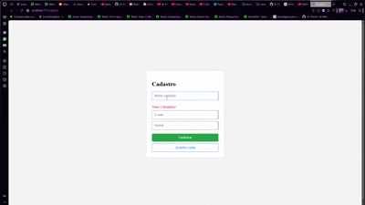
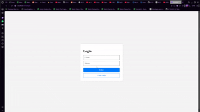
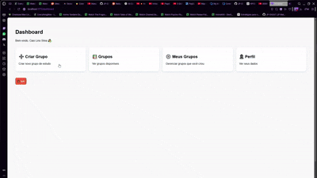
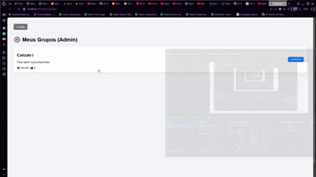
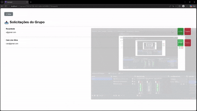
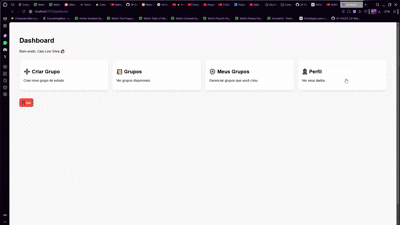

# Conexxa — Demonstração do Sistema

🇧🇷 Plataforma de gerenciamento de grupos de estudo universitários.

---

# 🌐 Acesso ao Projeto

## Frontend
https://conexxa-1.onrender.com

## Backend API
https://conexxa-eemn.onrender.com

## Repositório
https://github.com/JP-GhOsT/Conexxa

---

# 📌 Visão Geral

O Conexxa é um sistema full-stack desenvolvido para facilitar a criação, gerenciamento e participação em grupos de estudo.

O sistema possui:
- autenticação JWT
- gerenciamento de grupos
- solicitações de entrada
- painel administrativo
- moderação de membros

---

# 🧠 Tecnologias Utilizadas

## Frontend
- React.js
- React Router DOM
- Axios
- React Toastify
- Vite

## Backend
- Node.js
- Express
- SQLite
- JWT
- UUID

---

# 🔐 Funcionalidades

## 👤 Usuário
- Cadastro
- Login
- Visualização de grupos
- Solicitação de entrada em grupos
- Acompanhamento de status

## 👨‍💼 Administrador
- Criação de grupos
- Edição de grupos
- Visualização de solicitações
- Aprovação de membros
- Rejeição de membros

---

# 🎬 Demonstração do Sistema

---

## 📝 Cadastro de Usuário

O usuário pode criar uma conta informando nome, email e senha.



---

## 🔑 Login

Autenticação utilizando JWT.



---

## 📚 Criação de Grupo

Administradores podem criar novos grupos de estudo.



---

## ✏️ Edição de Grupo

O administrador pode atualizar informações do grupo.



---

## 📩 Solicitação de Entrada

Usuários podem solicitar participação em grupos.


---

## ✅❌ Aprovação e Rejeição de Solicitações

O administrador pode aceitar ou rejeitar solicitações de entrada.



---

## 🚪 Logout

Encerramento seguro da sessão do usuário.



---

# 🗄️ Estrutura do Banco de Dados

## users
| Campo | Tipo |
|---|---|
| id | TEXT |
| nome_completo | TEXT |
| email | TEXT |
| senha_hash | TEXT |

---

## groups
| Campo | Tipo |
|---|---|
| id | TEXT |
| subject | TEXT |
| objective | TEXT |
| location_type | TEXT |
| participant_limit | INTEGER |
| creator_id | TEXT |

---

## group_memberships
| Campo | Tipo |
|---|---|
| id | TEXT |
| group_id | TEXT |
| user_id | TEXT |
| status | TEXT |
| created_at | DATETIME |
| updated_at | DATETIME |

---

# 🔐 Segurança

- JWT Authentication
- Middleware de proteção
- Controle de acesso
- Rotas protegidas
- Validação de permissões administrativas

---

# 🚀 Como Executar Localmente

## Backend

```bash
cd backend
npm install
node src/server.js
```

---

## Frontend

```bash
cd frontend
npm install
npm run dev
```

---

# ⚠️ Observação

O backend está hospedado no plano gratuito do Render.

A primeira requisição pode demorar alguns segundos devido ao cold start.

---

# 👨‍💻 Equipe

- João Paulo Zimmermann Matsui - [GitHub](https://github.com/JP-GhOsT) | [Linkedin](https://linkedin.com/in/joaomatsui)
- Gustavo Sena de Souza - [GitHub](https://github.com/gustavosena025-dotcom) | [Linkedin](https://www.linkedin.com/in/gustavo-sena-ads-ia/)
- Robson dos Santos Damasceno Lisboa - [GitHub](https://github.com/RobsonDamsceno) | [Linkedin](https://www.linkedin.com/in/robson-damasceno-b35954356/)
- Caio dos Santos Gregorio da Rocha - [GitHub](https://github.com/caioogregorio) | [Linkedin](https://www.linkedin.com/in/caioogregorio/)
- Diego Mathias da Fonseca - [GitHub](https://github.com/diegomathiasdev) | [Linkedin](https://www.linkedin.com/in/diegomathiasdafonseca/)

---

# 📌 Informações do Projeto

| Item | Informação |
|---|---|
| Projeto | Conexxa |
| Tipo | Projeto acadêmico full-stack |
| Arquitetura | REST API |
| Banco de Dados | SQLite |
| Autenticação | JWT |
| Deploy | Render |
| Integração | Azure DevOps MCP + AI Assistant |

---

# ⭐ Considerações Finais

O projeto demonstra conhecimentos práticos em:
- desenvolvimento full-stack
- modelagem de banco de dados
- autenticação JWT
- integração frontend/backend
- APIs REST
- deploy em nuvem
- gerenciamento de estado
- controle de permissões
- fluxo de aprovação administrativa
